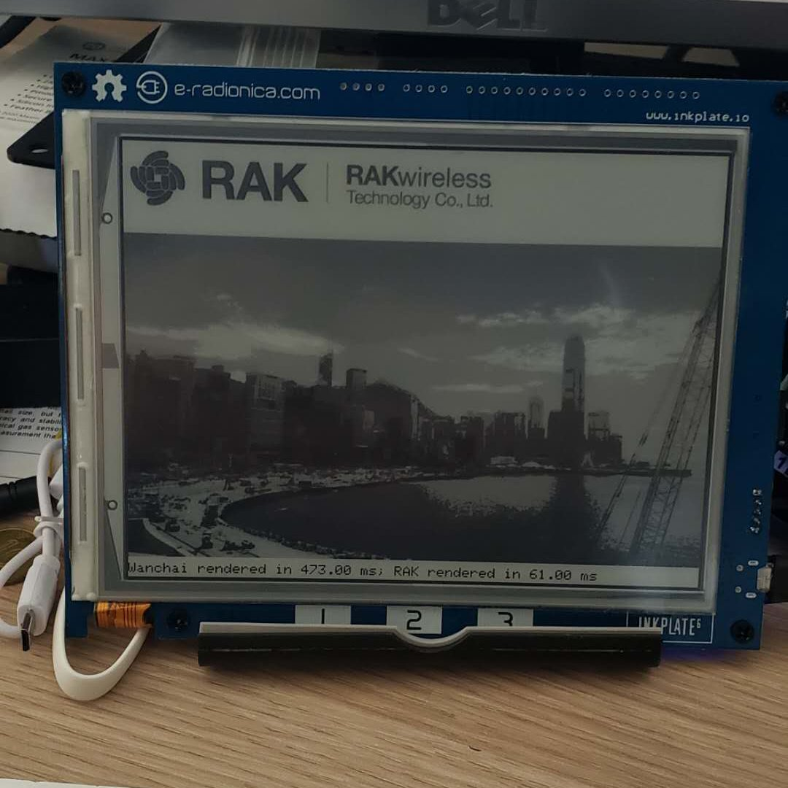

# Inkplate_Raw_Bitmap

A demo for the Inkplate 6 featuring drawing bitmap images from the SD card and interaction via touch buttons.

The bitmap images are encoded in a simple format:

width, height, then 2 pixels per byte.

See https://github.com/Kongduino/Image_To_LCD for a Xojo project to create such images.